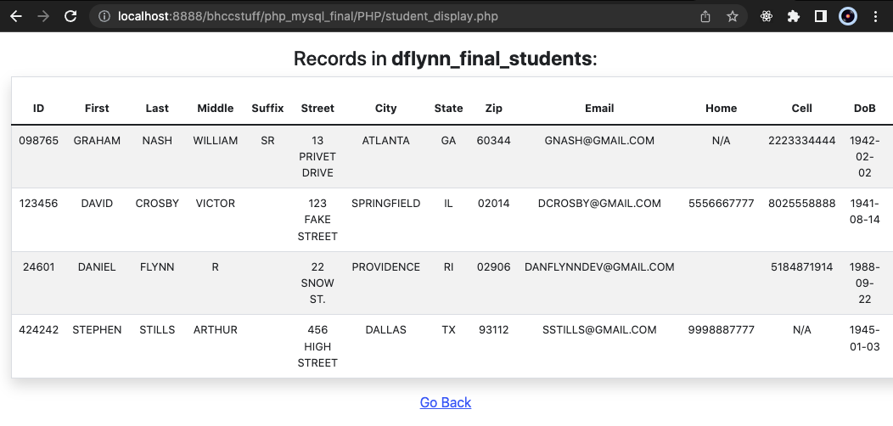

# Mock Student & Courses Database
## CMT241 PHP/MySQL Final Project

Completed for the Fall 2021 semester at BHCC

### Goals of this project:

- Demonstrate competence interfacing with a MySQL database using PHP
- Use an HTML form to validate and upload user input to the DB
- Query the database using an inner join and display results

### Usage

To run this project upload to a server running PHP. I simply use MAMP and have this folder in /htdocs. Enter the MySQL server configuration by editing /PHP/credentials.php. Make sure what gets entered for `$database` is a schema that exists on the MySQL server.

To use the test data, click Admin and construct the student table. Populate student records, then create Courses table and populate those records. It must be done in this order due to the FK constraint. To reinitialize, drop the courses table, then the student table.

To view the results of the inner join query, use Query Courses under Student Table actions. For the test dataset use `424242`.

### Additional Features 

(added by me, not stated in project requirements)

- Foreign Key integrity between tables
- User can search course completion data using Student ID
- An admin panel was created to quickly re-initialize the database for testing purposes
- Easy navigation links provided
- Bootstrap for styling

### Limitations

- The data does not follow best modeling practices like normalization. The shape of the dataset conforms to the instructors expectation.
- Lots of repetition across files. Needs to be DRY-ed out.
- No authorization implemented for admin functionality - outside the scope of this project.

### Images

